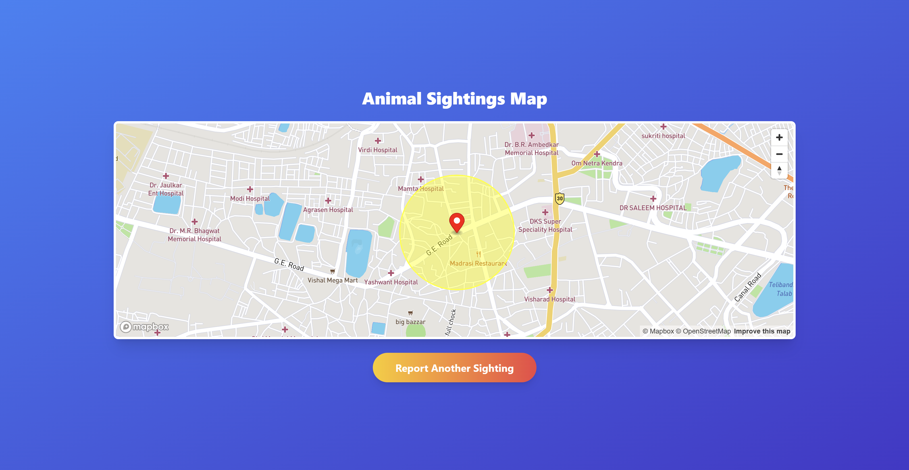
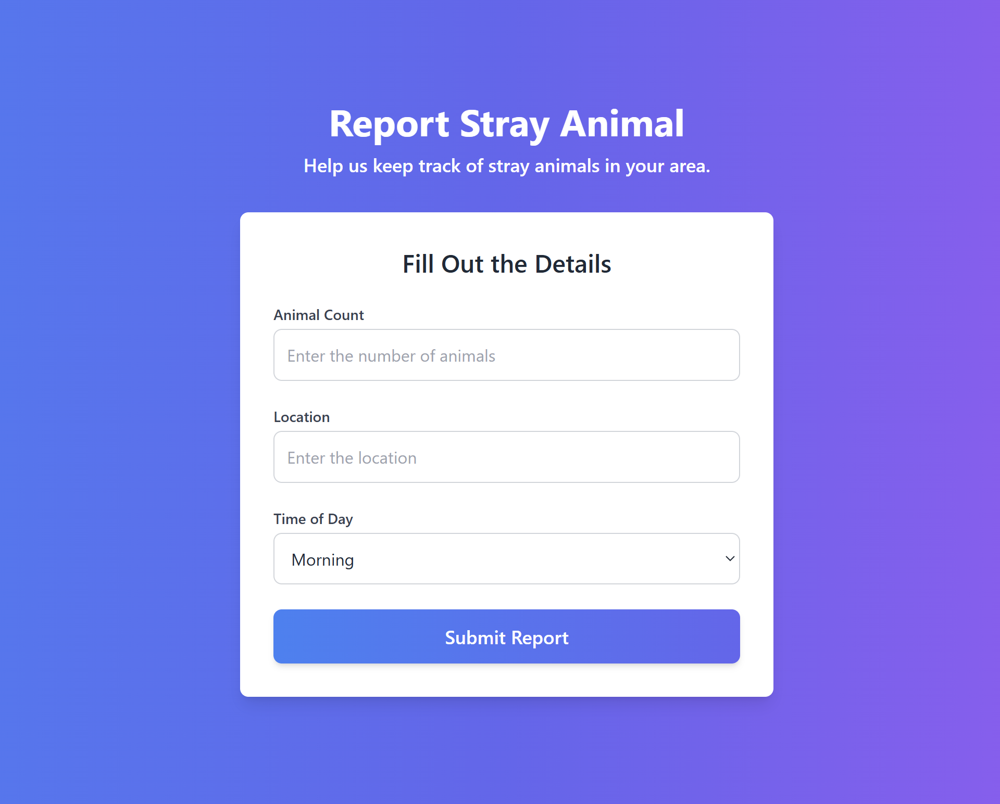

# Stray Animal Reporting and Risk Prediction System

## Overview
Stray animals on roadways pose significant challenges to road safety, leading to accidents, injuries, and property damage. This project introduces a **Stray Animal Reporting and Risk Prediction System** that combines **machine learning** and a user-friendly frontend to predict risk levels associated with stray animals and visualize them on a map.

---

## Project Highlights
- **Core Features**:
  - Predicts risk levels (low, medium, high) for regions based on user-reported and environmental data.
  - Provides interactive map-based visualization of risk zones.
  - Leverages a deep learning model for risk score prediction.

- **Key Components**:
  - **Machine Learning Model**: A neural network that predicts a continuous risk score based on geospatial and environmental features.
  - **Frontend**: A web app enabling users to report stray animals and view risk predictions on a map.

---





## Table of Contents
- [Machine Learning Model](#machine-learning-model)
- [Frontend](#frontend)
- [How It Works](#how-it-works)
- [Setup and Usage](#setup-and-usage)
- [Future Work](#future-work)
- [License](#license)

---

## Machine Learning Model

### 1. Objective
The machine learning model predicts a **risk score** (0.0–1.0) for specific regions based on:
- **Geospatial Data**: Latitude, longitude.
- **Environmental Data**: Weather, traffic levels.
- **User-Reported Data**: Animal type, count, and time of sighting.

The risk score is categorized into:
- **Low Risk (0.0–0.33)**: Minimal likelihood of accidents.
- **Medium Risk (0.33–0.66)**: Moderate likelihood of accidents.
- **High Risk (0.66–1.0)**: Significant likelihood of accidents.

### 2. Dataset
- **Fabricated Dataset**: Initially simulated to replicate real-world conditions.
- **Dynamic Updates**: Designed to integrate real-time user reports for periodic retraining.
- **Features**:
  - Categorical: Weather, time of day, traffic level, area type.
  - Numerical: Latitude, longitude, number of animal sightings.

### 3. Model Architecture
The neural network model was built using **TensorFlow/Keras**:
- **Input Layer**: Processes 20+ features (after preprocessing).
- **Hidden Layers**:
  - 64, 32, and 16 neurons with **ReLU activation**.
  - **Dropout layers** to prevent overfitting (30% and 20% rates).
- **Output Layer**: A single neuron with **linear activation function** for regression.
- **Loss Function**: Mean Squared Error (MSE).
- **Optimizer**: Adam.

### 4. Performance
- **Training Metrics**:
  - Loss (MSE): 0.042 (Training), 0.056 (Validation).
  - Mean Absolute Error (MAE): 0.17.
- **Evaluation Metrics**:
  - **R-squared**: 0.83, demonstrating strong predictive accuracy.
- **Risk Categorization**:
  - Predicted risk scores aligned closely with ground truth labels for low, medium, and high-risk zones.

---

## Frontend

The frontend is a **responsive web application** designed to enable users to report stray animals and visualize risk zones interactively. Built with **HTML**, **CSS**, and **JavaScript**, it features a clean interface and geospatial tools for intuitive navigation.

### Core Features:
1. **Landing Page**:
   - Provides an overview of the project and navigation to reporting and risk visualization pages.

2. **Map Visualization**:
   - Powered by **Mapbox API** for interactive map rendering.
   - Displays **color-coded risk zones** (High: Red, Medium: Orange, Low: No Color) within a **200-meter radius**.
   - Allows dynamic marker placement for reported locations.

3. **Reporting Form**:
   - User-friendly form to submit details of stray animal sightings, including animal count and geolocation.
   - Prepares data for integration with backend systems.

4. **Dynamic Functionality**:
   - Implements geocoding, marker placement, and radius visualization using **JavaScript**.
   - Modular design ensures easy scalability and backend integration.

### Future Enhancements:
- **Real-Time Data Integration**: Replace local storage with backend API support.
- **Advanced Visualizations**: Heatmaps and clustering for multiple reports.
- **Enhanced User Interaction**: Tooltips and detailed overlays for risk zones.

---

## How It Works

1. **User Reporting**:
   - Users report stray animal sightings via the web app.
   - Features like animal count, location, time of day, and weather are captured.

2. **Risk Prediction**:
   - The ML model predicts risk scores based on geospatial and environmental factors.
   - Risk scores are categorized and visualized as colored circles (red, orange, no color) on the map.

3. **Future Integration**:
   - The current system uses local storage but is designed to integrate a backend for real-time data handling and periodic model retraining.

---

## Setup and Usage

### 1. Prerequisites
- **Python 3.x** (for ML model training and evaluation).
- **HTML, CSS, and JavaScript** (for the frontend).
- Libraries:
  - `pandas`, `numpy`, `scikit-learn`, `tensorflow`, `matplotlib`.

### 2. Running the Machine Learning Model
```bash
# Clone the repository
git clone https://github.com/username/project-name.git
cd project-name

# Install dependencies
pip install -r requirements.txt

# Train and evaluate the ML model
python train_model.py
```
### 3. Running the Web App
Open index.html in a web browser to access the frontend interface.

---

## Future Work

### Backend Integration:
- APIs for storing user reports and fetching risk predictions.
- PostgreSQL for managing data.

### Model Enhancements:
- Incorporate real-time weather and traffic data.
- Use advanced models like Gradient Boosting for improved accuracy.

### Real-Time Alerts:
- Push notifications for high-risk zones.

---

## License

This project is licensed under the MIT License.
